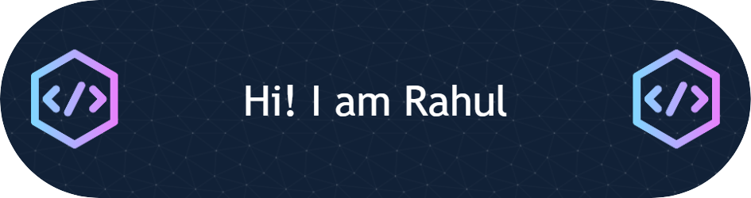

  

## I'm a Developer, and Student!

- 🌱 I’m currently learning everything 🤣 and eager to learn new Technologies
- 👯 I’m looking to collaborate with other developers
- 💬 Ask me about Webdevelopment, Computer networks , problem solving and basic problems occur in windows OS 
- ⚡ Fun fact: I intrested in solving problems apart from programing:

### Connect with me:

 
 

### Languages Known:

 
 

###  Tools Used:

 
 

###  Programming Platforms used:

 
 

 

  

 

<a> 
    
  
   
</a>

 

